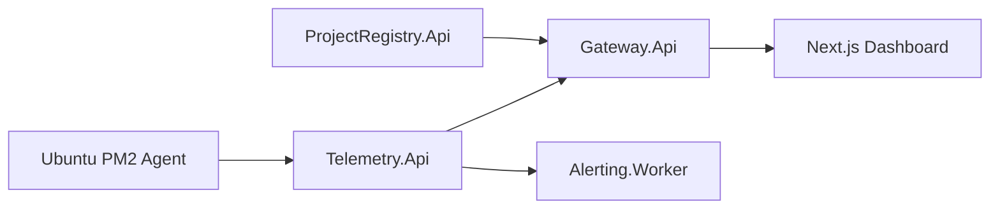

# OpsPulse Architecture

## Goal

Build a realistic DevOps monitoring platform that can be shown in a portfolio and later attached to the current university-hosted project.

The first project runs on an Ubuntu server behind VPN access, with Nginx reverse proxy and PM2 managing `frontend`, `admin`, and `backend` processes.

## MVP Scope

The MVP focuses on one monitored project:

- server profile and access model
- PM2 process inventory
- HTTP endpoint checks
- host metrics snapshot
- health scoring
- alert evaluation
- dashboard aggregation

The data model uses project IDs everywhere so additional projects can be added without changing service boundaries.

## Service Boundaries

`ProjectRegistry.Api` owns project inventory: project name, environment, owner, server metadata, and endpoint targets.

`Telemetry.Api` owns telemetry ingestion and retrieval: host metrics, process metrics, endpoint checks, and snapshot history.

`Alerting.Worker` owns scheduled alert evaluation. The worker reads telemetry and emits alert logs now; later it can persist alert events or send notifications.

`Gateway.Api` owns dashboard composition. It calls registry and telemetry, evaluates display-ready alerts and timeline points, then returns the frontend contract.

`Platform.Domain` owns shared policy that must be consistent across APIs and tests: health scoring and alert rules.

## Data Flow

## Production Direction

For the university server, run the agent inside the VPN-accessible environment or over a secure tunnel. The agent posts snapshots to `Telemetry.Api` using a project token. Public dashboard access should go through `Gateway.Api`, with authorization added before real deployment.
